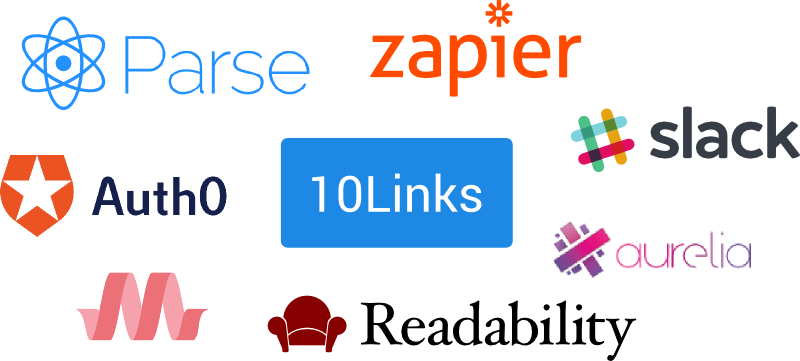

# Case study: 10Links

## The idea

At 10Clouds we produce a lot of links to interesting articles, github repositories and applications on a daily basis. They land on our mailing list and various Slack channels, and after a while they get buried underneath other conversations.

For our [5th Hackday event][5th hackday post], we decided to tackle the problem of the disappearing knowledge base by creating a simple app gathering links, so we can easily access them in the future.

## Targets

The theme of the latest hackday was trying out various backend as a service products. We've decided to take it to the extreme and set ourselves the goal of not using any custom servers, focusing on using 3rd party products and minimal glue code.

Before the event we've researched available tools and selected:
- [Parse][] as our data store
- [Auth0][] as the authentication provider
- [Readability API][] for article extraction
- [Zapier][] for link extraction

Finally, the web app was built using the [Aurelia framework][aurelia] and [Materialize CSS][], and hosted on [GitHub Pages][].

## Gluing it all together

First off, the user has to sign in using our Google domain and obtain a Parse session token in order to work with our backend. Since Parse doesn't provide a simple way to log in Google users, we've added Auth0 to the stack. 

Auth0 provided both a widget for logging users in - [Auth0 Lock][], as well as the ability to write [custom rules][auth0 rules] in javascript, which let us obtain a Parse session token as a part of the authentication flow.

Once the user is in, he can view the latest links gathered by our backend services. The whole link extraction flow was built around Zapier, as it enabled us to easily create hooks that pulled data from our Slack and Google group and sent it to Parse. On the Parse side, we've glued everything together usign [Parse Cloud Code][], similarly to Auth0 rules, it enabled us to write custom code, which was responsible for both extracting links from messages, as well as automatically extracting articles from these links using the [Readability Parser API][readability parser].

## 10Links

## Future plans & Summary
- tags
- search

[5th hackday post]: http://10clouds.com/blog/hackday-v-why-we-all-love-codefesting/
[aurelia]: http://aurelia.io/
[auth0]: https://auth0.com/
[auth0 lock]: https://auth0.com/lock
[auth0 rules]: https://auth0.com/docs/rules
[google groups]: https://groups.google.com
[materialize css]: http://materializecss.com/
[parse]: https://parse.com/
[parse cloud code]: https://parse.com/docs/js/guide#cloud-code
[readability api]: https://www.readability.com/developers/api/
[readability parser]: https://www.readability.com/developers/api/parser
[readability]: https://www.readability.com/
[slack]: https://slack.com/
[zapier]: https://zapier.com
[github pages]: https://pages.github.com/
